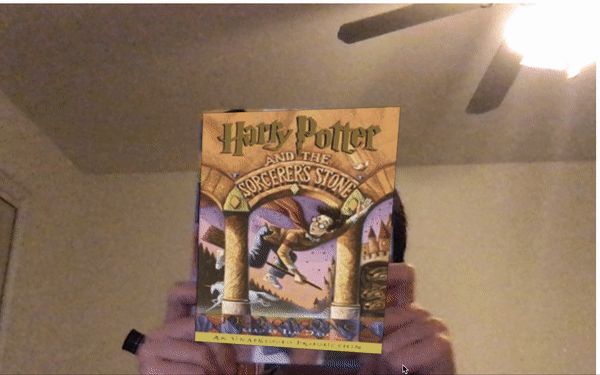

# Planar Homography Estimation and Image Tracking Running in WASM

Demo on laptop                    |  Demo on iPhone
:--------------------------------:|:-------------------------:
   |  

## Try it out

Try it out here (tap the screen to enable and disable tracking):

[https://edwardlu2018.github.io/wasm-ar/](https://edwardlu2018.github.io/wasm-ar/)

Reference image [here](https://github.com/EdwardLu2018/wasm-ar/blob/master/html/ref.jpg?raw=1).

## Pipeline

1. Pass image from video stream as an array from JavaScript to WASM program. Turn image to grayscale.
2. Find homography matrix by creating and matching ORB descriptor keypoints from reference image to video frame.
3. Take those descriptor points from the video frame and track them using Lucas-Kanade tracking algorithm.
4. Find 2d affine transform ```T``` of descriptor points from one frame to the next and update homography matrix. ```H = T * H```
5. Pass homography matrix and warped corner points back to JavaScript and warp iframe element with homography matrix.
6. If homography matrix becomes invalid or at most 1/3 of tracked descriptor points are lost, repeat step 2.

## Building

You need git, cmake and python installed. You need also to clone OpenCV in the root of the project.
Run:
```
git clone https://github.com/opencv/opencv.git
```
Build OpenCV with WebAssembly support (make sure you have Emscripten installed! emsdk version 1.39.16 is recommended):
```
python ./platforms/js/build_js.py build_wasm --build_wasm
```
The python script will build the static and the WASM lib in the build_wasm folder.

Additional instructions to build OpenCV with WebAssembly support [here](https://docs.opencv.org/master/d4/da1/tutorial_js_setup.html).

Then, run:
```
./build.sh
```
